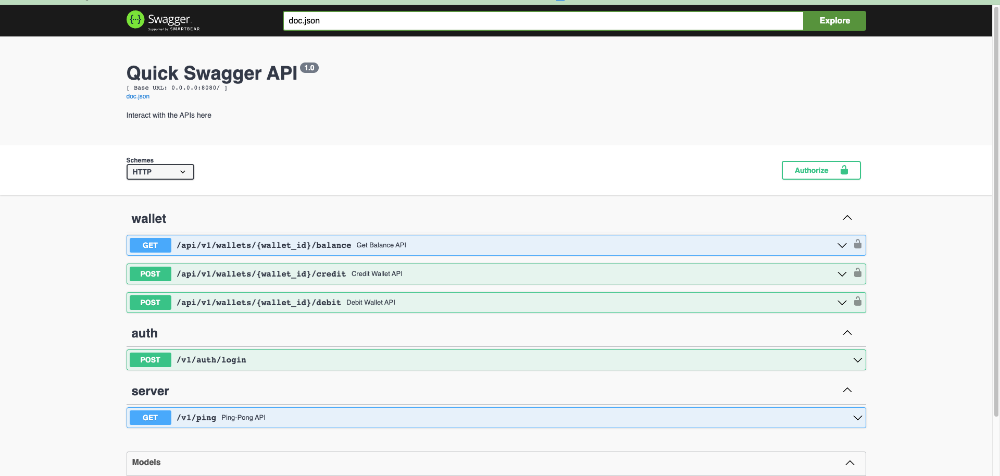

# quick

Managing wallet service


## Development

You can spin off the mysql and redis instances with docker -> `make run` 

run server: `make local-server`   
hot reloads: `go install github.com/cespare/reflex@latest` -> `make watch`  

***
## Tests

``` bash
make test
```

***
## Logs 

To see the logs of the running container:

``` bash
make logs
```

***
## Docs

If you want to add or modify the docs:   
- Install swag -> ‍‍‍```go install github.com/swaggo/swag/cmd/swag@latest```
then -> make docs   

### Swagger UI

http://0.0.0.0:8080/swagger/index.html


  

***

## Security
To access the APIs you need to authenticate.
Some users along with wallets get pre-populated into the database once you run the application. Once you're in the swagger api, first use the login API to get a token ex. `username:user1,password:password1` then click on the Authorize button and use the following format:  

-> `Bearer THE_TOKEN_YOU_RECEIVED`

***
